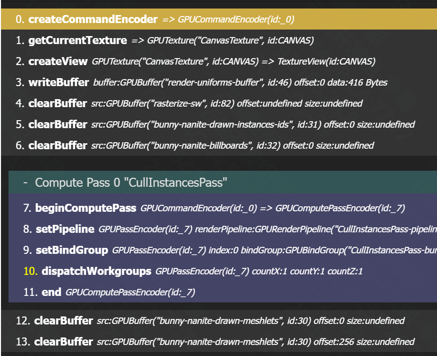

# WebGPU管线图

# cullInstancePass Shader
`
    const b11 = 3u; // binary 0b11
    const b111 = 7u; // binary 0b111
    const b1111 = 15u; // binary 0b1111
    const b11111 = 31u; // binary 0b11111
    const b111111 = 63u; // binary 0b111111

    struct Uniforms {
      vpMatrix: mat4x4<f32>,
      vpMatrixInv: mat4x4<f32>,
      viewMatrix: mat4x4<f32>,
      projMatrix: mat4x4<f32>,
      viewport: vec4f,
      cameraPosition: vec4f,
      cameraFrustumPlane0: vec4f, // TODO [LOW] there are much more efficient ways for frustum culling
      cameraFrustumPlane1: vec4f, // https://github.com/zeux/niagara/blob/master/src/shaders/drawcull.comp.glsl#L72
      cameraFrustumPlane2: vec4f,
      cameraFrustumPlane3: vec4f,
      cameraFrustumPlane4: vec4f,
      cameraFrustumPlane5: vec4f,
      // b1 - frustom cull
      // b2 - occlusion cull (ends at: 1 << 1)
      // b3,4,5 - shading mode (1 << 2 to 1 << 4)
      // b6,7 - instances culling (1 << 5, 1 << 6)
      // b8,9,10,11 - debug render depty pyramid level (value 0-15)
      // b12,13,14,15 - debug override occlusion cull depth mipmap (value 0-15). 0b1111 means OFF
      // b16 - force billboards
      // b17,b18,b19,b20,b21,b22 - billboard dithering
      // b23..32 - not used
      flags: u32,
      billboardThreshold: f32,
      softwareRasterizerThreshold: f32,
      padding0: u32,
      colorMgmt: vec4f,
    };
    @binding(0) @group(0)
    var<uniform> _uniforms: Uniforms;

    fn checkFlag(flags: u32, bit: u32) -> bool { return (flags & bit) > 0; }
    fn useFrustumCulling(flags: u32) -> bool { return checkFlag(flags, 1u); }
    fn useOcclusionCulling(flags: u32) -> bool { return checkFlag(flags, 2u); }
    fn useInstancesFrustumCulling(flags: u32) -> bool { return checkFlag(flags, 32u); }
    fn useInstancesOcclusionCulling(flags: u32) -> bool { return checkFlag(flags, 64u); }
    fn useForceBillboards(flags: u32) -> bool { return checkFlag(flags, 65536u); }
    fn getShadingMode(flags: u32) -> u32 {
      return (flags >> 2u) & b111;
    }
    fn getDbgPyramidMipmapLevel(flags: u32) -> i32 {
      return i32(clamp((flags >> 8u) & b1111, 0u, 15u));
    }
    fn getOverrideOcclusionCullMipmap(flags: u32) -> i32 {
      let v: u32 = clamp((flags >> 12u) & b1111, 0u, 15u);
      if (v == 15u) { return -1; }
      return i32(v);
    }
    fn getBillboardDitheringStrength(flags: u32) -> f32 {
      let v: u32 = (flags >> 17u) & b111111; // [0-64]
      return f32(v) / 63.0;
    }
  

fn getMVP_Mat(modelMat: mat4x4<f32>, viewMat: mat4x4<f32>, projMat: mat4x4<f32>) -> mat4x4<f32> {
  let a = viewMat * modelMat;
  return projMat * a;
}

fn ceilDivideU32(numerator: u32, denominator: u32) -> u32 {
  return (numerator + denominator - 1) / denominator;
}

fn isInsideCameraFrustum(
  modelMat: mat4x4<f32>,
  boundingSphere: vec4f
) -> bool {
  var center = vec4f(boundingSphere.xyz, 1.);
  center = modelMat * center;
  let r = boundingSphere.w;
  let r0 = dot(center, _uniforms.cameraFrustumPlane0) <= r;
  let r1 = dot(center, _uniforms.cameraFrustumPlane1) <= r;
  let r2 = dot(center, _uniforms.cameraFrustumPlane2) <= r;
  let r3 = dot(center, _uniforms.cameraFrustumPlane3) <= r;
  let r4 = dot(center, _uniforms.cameraFrustumPlane4) <= r;
  let r5 = dot(center, _uniforms.cameraFrustumPlane5) <= r;
  return r0 && r1 && r2 && r3 && r4 && r5;
}

fn clampToMipLevels(v: i32, _texture: texture_2d<f32>) -> i32 {
  let mipLevels = textureNumLevels(_texture);
  return clamp(v, 0, i32(mipLevels - 1)); // 8 mip levels mean indices 0-7
}

/** Returns value [zNear, zFar] */
fn linearizeDepth(depth: f32) -> f32 {
  let zNear: f32 = 0.01f;
  let zFar: f32 = 100f;
  
  // PP := projection matrix
  // PP[10] = zFar / (zNear - zFar);
  // PP[14] = (zFar * zNear) / (zNear - zFar);
  // PP[11] = -1 ; PP[15] = 0 ; w = 1 
  // z = PP[10] * p.z + PP[14] * w; // matrix mul, but x,y do not matter for z,w coords
  // w = PP[11] * p.z + PP[15] * w;
  // z' = z / w = (zFar / (zNear - zFar) * p.z + (zFar * zNear) / (zNear - zFar)) / (-p.z)
  // p.z = (zFar * zNear) / (zFar + (zNear - zFar) * z')
  return zNear * zFar / (zFar + (zNear - zFar) * depth);
  
  // OpenGL:
  // let z = depth * 2.0 - 1.0; // back to NDC
  // let z = depth;
  // return (2.0 * zNear * zFar) / (zFar + zNear - z * (zFar - zNear));
}

/** Returns value [0, 1] */
fn linearizeDepth_0_1(depth: f32) -> f32 {
  let zNear: f32 = 0.01f;
  let zFar: f32 = 100f;
  let d2 = linearizeDepth(depth);
  return d2 / (zFar - zNear);
}

/**
 * Everything closer than this will always pass the occlusion culling.
 * This fixes the AABB projection problems when sphere is near/intersecting zNear.
 * Most 'simple' sphere projection formulas just do not work in that case.
 * Technically we could test in view-space, smth like:
 *    'sphere.z < zNear && sphere.z + r > zNear'.
 * You will get flicker and instabilities.
 * 
 * Look, 1h ago I have rewritten bounding sphere radius calc and had 1e-9
 * differences to old approach. The math sometimes..
 * 
 * I DON'T HAVE TO DEAL WITH THIS.
 * 
 * Exact value choosen cause I say so.
 */
const CLOSE_RANGE_NEAR_CAMERA: f32 = 4.0;

/** 
 * https://www.youtube.com/live/Fj1E1A4CPCM?si=PJmBhKd_TQk1GMOb&t=2462 - triangles
 * https://www.youtube.com/watch?v=5sBpo5wKmEM - meshlets
*/
fn isPassingOcclusionCulling(
  modelMat: mat4x4<f32>,
  boundingSphere: vec4f,
  dbgOverrideMipmapLevel: i32 // if >=0 then overrides mipmap level for debug
) -> bool {
  let viewportSize = _uniforms.viewport.xy;
  let viewMat = _uniforms.viewMatrix;
  let projMat = _uniforms.projMatrix;

  // project meshlet's center to view space
  // NOTE: view space is weird, e.g. .z is NEGATIVE!
  let center = viewMat * modelMat * vec4f(boundingSphere.xyz, 1.);
  let r = boundingSphere.w;

  let closestPointZ = abs(center.z) - r;

  // get AABB in projection space
  var aabb = vec4f();
  let projectionOK = projectSphereView(projMat, center.xyz, r, &aabb);
  if (!projectionOK) { return true; } // if is close to near plane, it's always visible
  // let aabb = getAABBfrom8ProjectedPoints(projMat, center.xyz, r);

  // calc pixel span at fullscreen
  let pixelSpanW = abs(aabb.z - aabb.x) * viewportSize.x;
  let pixelSpanH = abs(aabb.w - aabb.y) * viewportSize.y;
  let pixelSpan = max(pixelSpanW, pixelSpanH);
  // return pixelSpanW * pixelSpanH > 100.; // death by thousand triangles..

  // Calc. mip level. If meshlet spans 50px, we round it to 64px and then sample log2(64) = 6 mip.
  // But, we calculated span in fullscreen, and pyramid level 0 is half. So add extra 1 level.
  var mipLevel = i32(ceil(log2(pixelSpan))); // i32 cause wgpu/deno
  if (dbgOverrideMipmapLevel >= 0) { mipLevel = dbgOverrideMipmapLevel; } // debug
  mipLevel = clampToMipLevels(mipLevel + 1, _depthPyramidTexture);
  // return mipLevel == 8; // 4 - far, 5/6 - far/mid, 8 - close

  // get the value from depth buffer (range: [0, 1]).
  // let mipSize = vec2f(textureDimensions(_depthPyramidTexture, mipLevel));
  // let samplePointAtMip = vec2u(aabb.xy * mipSize.xy);
  // let depthFromDepthBuffer = textureLoad(_depthPyramidTexture, samplePointAtMip, mipLevel).x;
  let depthFromDepthBuffer = textureSampleLevel(_depthPyramidTexture, _depthSampler, aabb.xy, f32(mipLevel)).x;
  // let depthFromDepthBuffer = 1.0;
  // return depthFromDepthBuffer == 1.0;

  /*
  // project the bounding sphere
  // PP[10 or 2|2] = -1.000100016593933
  // PP[14 or 3|2] = -0.010001000016927719
  let d = center.z - r; // INVESTIGATE: +/- to get closest?
  var depthMeshlet = (projMat[2][2] * d + projMat[3][2]) / -d; // in [0, 1]
  
  return depthMeshlet <= depthFromDepthBuffer;
  */
  let depthFromDepthBufferVS = linearizeDepth(depthFromDepthBuffer); // range [zNear .. zFar]
  return closestPointZ <= depthFromDepthBufferVS; // if there is any pixel that is closer than 'prepass-like' depth
}

/** project view-space AABB */
fn getAABBfrom8ProjectedPoints(projMat: mat4x4f, center: vec3f, r: f32) -> vec4f {
  let bb0 = getBB(projMat, center.xyz, r, vec3f( 1.,  1., 1.));
  let bb1 = getBB(projMat, center.xyz, r, vec3f(-1., -1., 1.));
  let bb2 = getBB(projMat, center.xyz, r, vec3f(-1.,  1., 1.));
  let bb3 = getBB(projMat, center.xyz, r, vec3f( 1., -1., 1.));
  //
  let bb4 = getBB(projMat, center.xyz, r, vec3f( 1.,  1., -1.));
  let bb5 = getBB(projMat, center.xyz, r, vec3f(-1., -1., -1.));
  let bb6 = getBB(projMat, center.xyz, r, vec3f(-1.,  1., -1.));
  let bb7 = getBB(projMat, center.xyz, r, vec3f( 1., -1., -1.));
  // aabb in [-1, 1]
  let aabbClip = vec4(
    min(min(min(bb0.x, bb1.x), min(bb2.x, bb3.x)), min(min(bb4.x, bb5.x), min(bb6.x, bb7.x))), // min x
    min(min(min(bb0.y, bb1.y), min(bb2.y, bb3.y)), min(min(bb4.y, bb5.y), min(bb6.y, bb7.y))), // min y
    max(max(max(bb0.x, bb1.x), max(bb2.x, bb3.x)), max(max(bb4.x, bb5.x), max(bb6.x, bb7.x))), // max x
    max(max(max(bb0.y, bb1.y), max(bb2.y, bb3.y)), max(max(bb4.y, bb5.y), max(bb6.y, bb7.y))), // max y
  );
  return (aabbClip + 1.0) * 0.5; // UV space
}

/** Calc in view space */
fn getBB(projMat: mat4x4f, center: vec3f, r: f32, dir: vec3f) -> vec4f {
  let p = center + r * dir;
  let pProj = projMat * vec4f(p, 1.);
  return pProj / pProj.w;
}

/**
 * https://github.com/zeux/niagara/blob/master/src/shaders/math.h#L2
 * https://zeux.io/2023/01/12/approximate-projected-bounds/
 * 2D Polyhedral Bounds of a Clipped, Perspective-Projected 3D Sphere. Michael Mara, Morgan McGuire. 2013
 * 
 * @param centerViewSpace sphere center (view space)
 * @param r radius
 */
fn projectSphereView(
  projMat: mat4x4f,
  centerViewSpace: vec3f,
  r: f32,
  pixelSpan: ptr<function, vec4f>
) -> bool {
  // abs cause view space is ???
  let zNear: f32 = 0.01;
  // if (abs(center.z) < r + 0.01){
  // let distanceToNearPlane = abs(center.z) - zNear;
  // if (distanceToNearPlane < r){
  let closestPointZ = abs(centerViewSpace.z) - r;
  if (closestPointZ < zNear + CLOSE_RANGE_NEAR_CAMERA){
    return false;
  }

  // WARNING: This code only works for perspective camera
  // For ortho I think you would have [c.x-r, c.y-r, c.x+r, c.y+r]?
  let c = vec3f(centerViewSpace.xy, -centerViewSpace.z); // see camera.ts
  let cr = c * r;
  let czr2 = c.z * c.z - r * r;

  let vx = sqrt(c.x * c.x + czr2);
  let minX = (vx * c.x - cr.z) / (vx * c.z + cr.x);
  let maxX = (vx * c.x + cr.z) / (vx * c.z - cr.x);

  let vy = sqrt(c.y * c.y + czr2);
  let minY = (vy * c.y - cr.z) / (vy * c.z + cr.y);
  let maxY = (vy * c.y + cr.z) / (vy * c.z - cr.y);

  
  let P00 = projMat[0][0];
  let P11 = projMat[1][1];
  var aabb = vec4(minX * P00, minY * P11, maxX * P00, maxY * P11);
  // swizzle cause Y-axis is down. We will do abs() regardless. Then convert to [0, 1]
  aabb = aabb.xwzy * vec4(0.5, -0.5, 0.5, -0.5) + vec4(0.5);
  *pixelSpan = aabb;

  return true;
}

fn projectSphereToScreen(
  modelMat: mat4x4<f32>,
  boundingSphere: vec4f,
  pixelSpan: ptr<function,vec2f>
) -> bool {
  // get AABB in projection space
  // TODO [LOW] duplicate from occlusion culling
  let viewportSize = _uniforms.viewport.xy;
  let viewMat = _uniforms.viewMatrix;
  let projMat = _uniforms.projMatrix;
  var aabb = vec4f();
  let center = viewMat * modelMat * vec4f(boundingSphere.xyz, 1.);
  let r = boundingSphere.w;
  let projectionOK = projectSphereView(projMat, center.xyz, r, &aabb);
  *pixelSpan = vec2f(
    abs(aabb.z - aabb.x) * viewportSize.x,
    abs(aabb.w - aabb.y) * viewportSize.y
  );
  return projectionOK;
}

// instance transforms

@group(0) @binding(1)
var<storage, read> _instanceTransforms: array<mat4x4<f32>>;

fn _getInstanceTransform(idx: u32) -> mat4x4<f32> {
  return _instanceTransforms[idx];
}

fn _getInstanceCount() -> u32 {
  return arrayLength(&_instanceTransforms);
}

// cull params

/** arg for https://developer.mozilla.org/en-US/docs/Web/API/GPUComputePassEncoder/dispatchWorkgroupsIndirect */
struct CullParams{
  // dispatch params
  workgroupsX: u32, // modified only by globalId=0
  workgroupsY: atomic<u32>,
  workgroupsZ: u32, // not modified
  /** when not limited by dispatch workgroup requirements */
  actuallyDrawnInstances: atomic<u32>,
  // other params:
  objectBoundingSphere: vec4f,
  allMeshletsCount: u32,
}
@group(0) @binding(2)
var<storage, read_write> _drawnInstancesParams: CullParams;

// cull: array with results

@group(0) @binding(3)
var<storage, read_write> _drawnInstancesList: array<u32>;

// billboard params

/** arg for https://developer.mozilla.org/en-US/docs/Web/API/GPUComputePassEncoder/dispatchWorkgroupsIndirect */
struct DrawIndirect{
  vertexCount: u32,
  instanceCount: atomic<u32>,
  firstVertex: u32,
  firstInstance : u32,
}
@group(0) @binding(4)
var<storage, read_write> _drawnImpostorsParams: DrawIndirect;

// billboard: array with results

@group(0) @binding(5)
var<storage, read_write> _drawnImpostorsList: array<u32>;

// depth pyramid + sampler
@group(0) @binding(6)
var _depthPyramidTexture: texture_2d<f32>;
@group(0) @binding(7)
var _depthSampler: sampler;

@compute
@workgroup_size(32, 1, 1)
fn main(
  @builtin(global_invocation_id) global_id: vec3<u32>,
) {
  // set rest of the indirect draw params. Has to be first line in the shader in case we ooopsie and do early return by accident somewhere.
  resetOtherDrawParams(global_id);

  let settingsFlags = _uniforms.flags;
  let boundingSphere = _drawnInstancesParams.objectBoundingSphere;
  let MAX_WORKGROUPS_Y: u32 = 32768u;

  
  // prepare iters
  let instanceCount: u32 = _getInstanceCount();
  let iterCount: u32 = ceilDivideU32(instanceCount, 32768u);
  let tfxOffset: u32 = global_id.x * iterCount;

  for(var i: u32 = 0u; i < iterCount; i++){
    let tfxIdx: u32 = tfxOffset + i;
    if (tfxIdx >= instanceCount) { continue; }
    let modelMat = _getInstanceTransform(tfxIdx);

    if (!isInstanceRendered(settingsFlags, modelMat, boundingSphere)){
      continue;
    }

    if (renderAsBillboard(settingsFlags, modelMat, boundingSphere)) {
      let idx = atomicAdd(&_drawnImpostorsParams.instanceCount, 1u);
      _drawnImpostorsList[idx] = tfxIdx;

    } else {
      // add 1, but no more than MAX_WORKGROUPS_Y.
      // meh impl, but..
      atomicAdd(&_drawnInstancesParams.workgroupsY, 1u);
      atomicMin(&_drawnInstancesParams.workgroupsY, MAX_WORKGROUPS_Y);
      
      // add to the ACTUALL total counter
      let idx = atomicAdd(&_drawnInstancesParams.actuallyDrawnInstances, 1u);
      _drawnInstancesList[idx] = tfxIdx;
    }
  } 
}

///////////////////////////
/// UTILS
///////////////////////////

fn isInstanceRendered(
  settingsFlags: u32,
  modelMat: mat4x4<f32>,
  boundingSphere: vec4f
) -> bool {
  if (
    useInstancesFrustumCulling(settingsFlags) &&
    !isInsideCameraFrustum(modelMat, boundingSphere)
  ) {
    return false;
  }

  let overrideMipmap = getOverrideOcclusionCullMipmap(settingsFlags);
  if (
    useInstancesOcclusionCulling(settingsFlags) &&
    !isPassingOcclusionCulling(modelMat, boundingSphere, overrideMipmap)
  ) {
    return false;
  }

  return true;
}

fn renderAsBillboard(
  settingsFlags: u32,
  modelMat: mat4x4<f32>,
  boundingSphere: vec4f
) -> bool {
  if (useForceBillboards(settingsFlags)) {
    return true;
  }

  var pixelSpan = vec2f();
  let projectionOK = projectSphereToScreen(modelMat, boundingSphere, &pixelSpan);
  return (
    projectionOK &&
    pixelSpan.x * pixelSpan.y < _uniforms.billboardThreshold
  );
}

fn resetOtherDrawParams(global_id: vec3<u32>){
  if (global_id.x == 0u) {
    _drawnInstancesParams.workgroupsX = ceilDivideU32(
      _drawnInstancesParams.allMeshletsCount,
      32u
    );
    _drawnInstancesParams.workgroupsZ = 1u;

    _drawnImpostorsParams.vertexCount = 6u; // billboard
    _drawnImpostorsParams.firstVertex = 0u;
    _drawnImpostorsParams.firstInstance = 0u;
  }
}

`